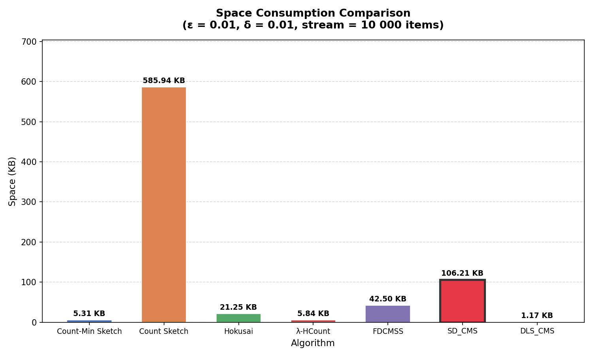
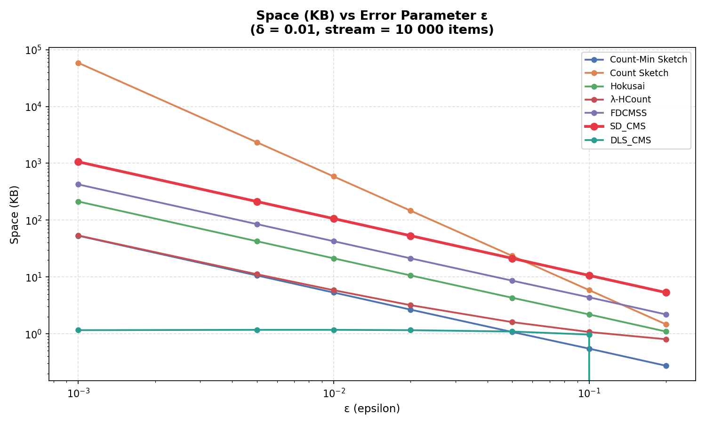
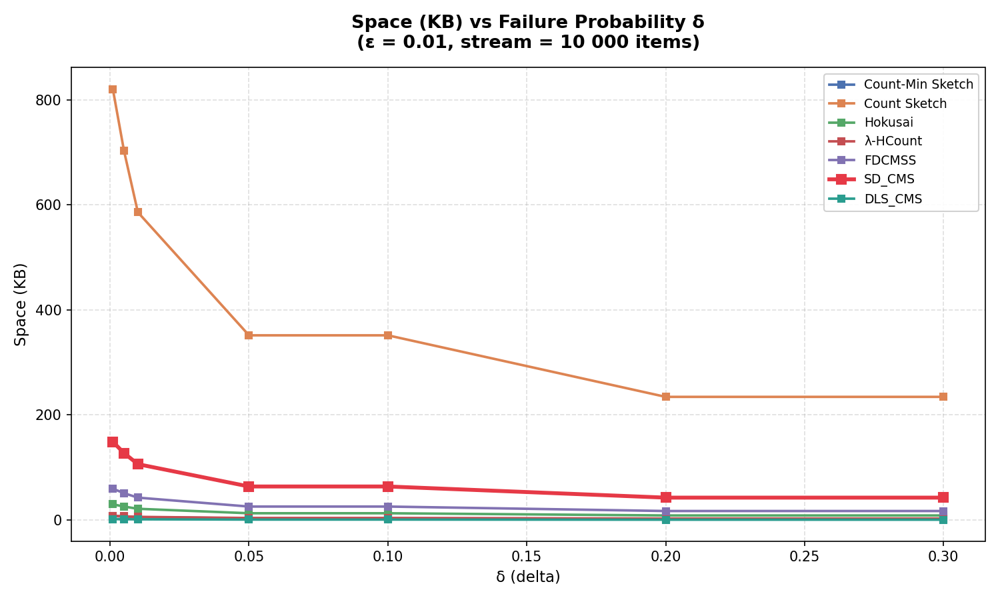
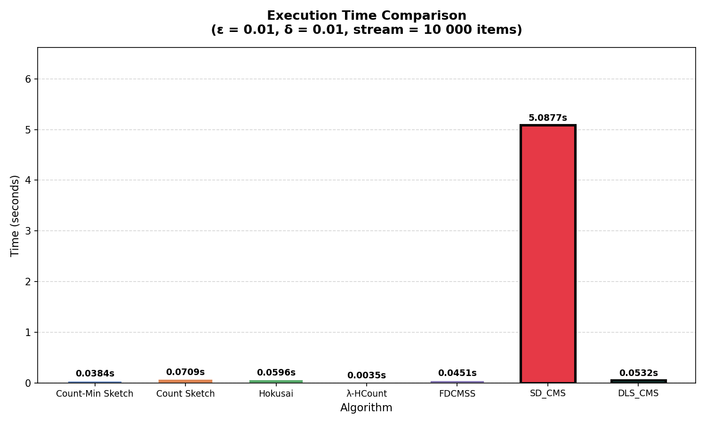
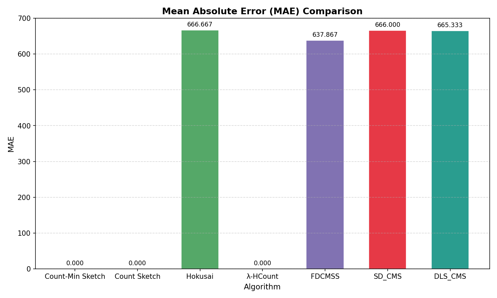

# DLS-CMS: Decayed Lazy Sparse Count-Min Sketch

> A space-efficient streaming algorithm for sliding-window frequency estimation with native deletion support and O(d) update complexity.


---

## Overview

Modern applications such as network monitoring, recommendation systems, fraud detection, and IoT analytics continuously generate massive data streams.

A fundamental challenge is:

> **How can we estimate item frequencies over recent data while using limited memory?**

Traditional Count-Min Sketch (CMS) efficiently estimates frequencies but cannot forget outdated information. As streams grow, old observations accumulate indefinitely, making CMS unsuitable for sliding-window analytics.

DLS-CMS (Decayed Lazy Sparse Count-Min Sketch) addresses this limitation through:

* Exponential decay for sliding-window behavior
* Lazy bucket updates for faster processing
* Sparse storage for memory efficiency
* Native deletion support using dual sketches
* CMS-style theoretical guarantees

---

## Key Highlights

| Feature                | DLS-CMS           |
| ---------------------- | ----------------- |
| Sliding Window Support | ✅                 |
| Deletion Support       | ✅                 |
| Sparse Storage         | ✅                 |
| Lazy Decay             | ✅                 |
| Update Complexity      | O(d)              |
| Query Complexity       | O(d)              |
| Space Complexity       | O((1/ε) log(1/δ)) |

### Experimental Results

* **4.5× lower memory usage than Count-Min Sketch**
* **90× lower memory usage than SD-CMS**
* Supports insertions and deletions simultaneously
* Maintains standard CMS asymptotic guarantees

---

## Problem Statement

Given a stream of updates:

```text
(x, Δ, t)
```

where:

* x = item
* Δ = update (+1 insertion, -1 deletion)
* t = timestamp

estimate item frequencies over recent history without storing the entire stream.

Traditional sketches accumulate all updates forever, while exact sliding-window approaches require significantly more memory.

DLS-CMS provides a memory-efficient alternative.

---

## Core Idea

DLS-CMS combines four concepts:

### 1. Exponential Decay

Older events gradually lose influence:

```math
f(x,t)=\sum \Delta_i \lambda^{(t-t_i)}
```

This creates a soft sliding window without explicitly storing historical elements.

---

### 2. Lazy Decay

Instead of updating every counter on each event:

```text
Traditional Decay: O(d × w)
```

DLS-CMS updates only the accessed buckets:

```text
DLS-CMS: O(d)
```

---

### 3. Sparse Storage

Only active buckets are stored.

Benefits:

* Lower memory consumption
* Faster updates
* Better scalability

---

### 4. Dual Sketch Architecture

```text
CMS+  → Insertions
CMS−  → Deletions
```

Frequency estimate:

```text
f̂(x) = max(0, min_i(v⁺ᵢ − v⁻ᵢ))
```

---

## Architecture

```text
Incoming Event (x, Δ, t)
              │
              ▼
        Is Δ > 0 ?
         /      \
        /        \
       ▼          ▼

   CMS+        CMS−
 Insertions   Deletions

       │          │
       └────┬─────┘
            │

    Sparse Hash Maps
    Lazy Decay
    Bucket Pruning

            │
            ▼

 Frequency Estimation
```

---

## Theoretical Guarantees

For:

```text
w = ⌈e/ε⌉
d = ⌈ln(1/δ)⌉
```

DLS-CMS satisfies:

```text
Pr[ f̂(x,t) − f(x,t) > εF ] ≤ δ
```

where:

```text
F = 1/(1−λ)
```

represents the effective window weight.

---

## Complexity Analysis

| Operation | Complexity        |
| --------- | ----------------- |
| Insert    | O(d)              |
| Delete    | O(d)              |
| Query     | O(d)              |
| Space     | O((1/ε) log(1/δ)) |

---

# Experimental Results

## Memory Comparison



## Space vs Epsilon



## Space vs Delta



## Runtime Comparison



## Accuracy (MAE)



---

## Benchmark Configuration

| Parameter       | Value  |
| --------------- | ------ |
| Stream Length   | 10,000 |
| Vocabulary Size | 15     |
| ε               | 0.01   |
| δ               | 0.01   |
| λ               | 0.95   |

---

## Comparison with Existing Methods

| Method           | Sliding Window | Deletion Support | CMS Space |
| ---------------- | -------------- | ---------------- | --------- |
| Count-Min Sketch | ❌              | ❌                | ✅         |
| Count Sketch     | ❌              | ✅                | ❌         |
| Hokusai          | ✅              | ❌                | ❌         |
| λ-HCount         | ✅              | ❌                | ✅         |
| FDCMSS           | ✅              | ❌                | ❌         |
| SD-CMS           | ✅              | ✅                | ✅         |
| **DLS-CMS**      | ✅              | ✅                | ✅         |

DLS-CMS is the only evaluated method that simultaneously provides:

* Sliding-window frequency estimation
* Deletion support
* Sparse memory utilization
* Standard CMS asymptotic complexity

---

## Repository Structure

```text
.
├── 1_count_min_sketch.py
├── 2_count_sketch.py
├── 3_hokusai.py
├── 4_lambda_hcount.py
├── 5_fdcmss.py
├── 6_sd_cms.py
├── dls_cms.py
│
├── compare_space.py
├── compare_space_ch.py
│
├── plot1_bar_space.png
├── plot2_line_space_vs_epsilon.png
├── plot3_line_space_vs_delta.png
├── plot4_time_comparison.png
├── plot5_accuracy_mae.png
│
├── Research_Paper.pdf
├── DLS_CMS_Presentation.pptx
└── README.md
```

---

## Running Experiments

Clone the repository:

```bash
git clone https://github.com/YOUR_USERNAME/DLS-CMS.git

cd DLS-CMS
```

Install dependencies:

```bash
pip install numpy matplotlib pandas
```

Run benchmark scripts:

```bash
python compare_space.py

python compare_space_ch.py
```

---

## Applications

* Network Traffic Monitoring
* Fraud Detection
* Recommendation Systems
* Web Analytics
* Streaming Databases
* IoT Sensor Analytics
* Cache Management

---

## Authors

**Akshat Pareek** (BT24CSD041)

**Harsh Patil** (BT24CSD033)

**Sutikshan Upman** (BT24CSD043)

Department of Computer Science & Engineering

Indian Institute of Information Technology Nagpur

---

## Research Artifacts

This repository includes:

* Full implementation of DLS-CMS
* Comparative benchmark suite
* Research paper
* Project presentation
* Experimental plots and results

---

## License

This project is licensed under the MIT License.

---

### ⭐ If you found this project useful, consider giving it a star.

### 📩 Suggestions and improvements are always welcome.
